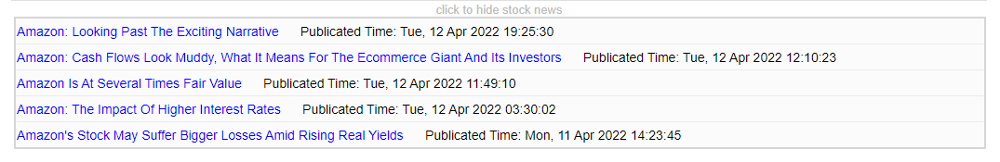

# Stock Manager
[](https://php.net/downloads.php)
Stock Manager is a web application with the following functionality
* Ability to track stock prices in real time
<p align="center">
  
</p>
* News of stock you entered
<p align="center">
  
</p>
* Registration of new users and authorization
<p align="center">
  
</p>
<p align="center">
  
</p>
* Personal area
<p align="center">
  
</p>

## Installation

```
git clone https://github.com/almasjss/StockManageHackathon.git
Download XAMPP
Add package to "htdocs"
Open phpmyadmin
Create "userinfo" database
Import "userinfo.sql"
```

## Usage
```
localhost/StockManageHackathon
```

